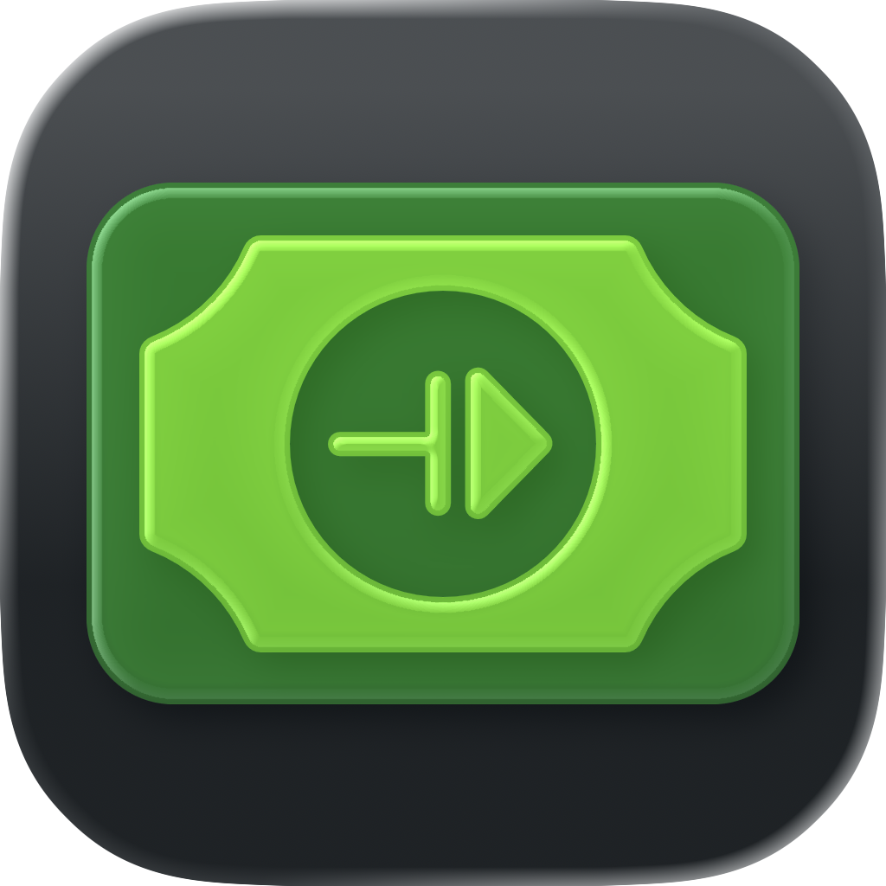

  

<h1 align="center">Relay</h1>

  Add transactions to YNAB & split them on a shared iCloud ledger, via Shortcuts & Wallet automation, and import bank statements

  

## Relay

## KEY FEATURES

### Add a transaction to YNAB

Quick-entry in the app, or hands-free from a Shortcut, Siri, or a widget.

### Split an expense

Shared expense lists ("ledgers") live in your own iCloud — no account, no
subscription, nothing leaves Apple's servers. Invite whoever you're splitting
with through the normal share sheet, then split in a tap or automate it from a
Wallet transaction. iOS only, by nature.

### File import

Send a bank or CSV statement to Relay from the share sheet and import it straight into YNAB — or split its rows on a ledger.

### Runs from anywhere

Every action is exposed as an App Intent, so you can wire it into Shortcuts, Siri, and widgets.

## Setup

This app authenticates with YNAB over OAuth2. To build it you need to register your own OAuth application and supply its client credentials, along with the small `oauth-relay` service used to complete the OAuth redirect flow (see the [`oauth-relay`](./oauth-relay) directory).

Ledgers need the **iCloud (CloudKit)** and **Push Notifications** capabilities on the app target, with a CloudKit container matching `iCloud.<bundle id>`. Deploy the schema to production in the CloudKit Console before shipping a build.

## Authentication

Relay signs in to YNAB with OAuth2:

- The app runs the browser-based sign-in itself (`ASWebAuthenticationSession`) and receives an authorization `code`.
- It exchanges that code (and later refreshes tokens) through the [`oauth-relay`](./oauth-relay) Cloudflare Worker rather than calling YNAB directly. The Worker holds the `client_secret`, so the secret never ships inside the app.
- Only the resulting access/refresh tokens are stored, and only in the **Keychain** (`Relay/Auth/KeychainStore.swift`). Tokens are never logged, never persisted elsewhere, and never sent to any third party — only to YNAB's own API.
- Relay never asks for or stores your actual YNAB or bank login credentials — only OAuth tokens.
- Ledgers involve no sign-in at all: they use the iCloud account already on the device, and Relay never sees a credential for it.

Signing out (`YNABAuthService.signOut()`) clears the tokens from the Keychain.

## Attribution

We are not affiliated, associated, or in any way officially connected with YNAB or any of its subsidiaries or affiliates. The official YNAB website can be found at https://www.ynab.com.

The names YNAB and You Need A Budget, as well as related names, tradenames, marks, trademarks, emblems, and images are registered trademarks of YNAB.

- [YNAB API](https://api.ynab.com/)

## Privacy

See the [privacy policy](./docs/privacy-policy.md).
